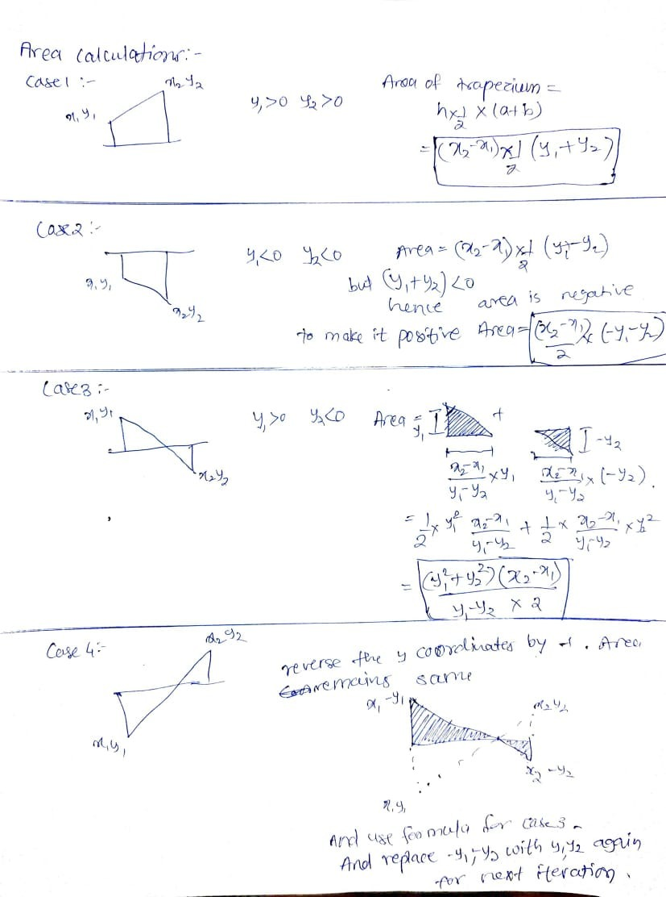
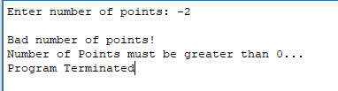
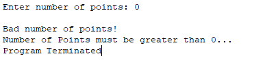
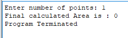
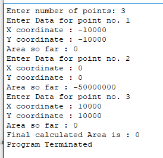
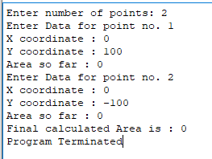
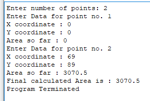

# Assignment - 1

###### Input:

n : number of points

next 2 x n lines for X and Y coordinates of each point

###### Output:

Area under a curve formed by joining successive points by a straight line

---

### Approach:

###### Workflow:

- Take number of points as input and store it in $t0 register and `points` memory location
- if number of points is less than 1 then input is invalid and `badterminate` branch is executed
- if number of points is 1 then area is outputed as 0
- else all n integers are taken input and area calculated till that point is also shown for better experience
- finally `terminate` branch is executed, total area is shown and program is terminated

###### Area Calculation:

- Area of complete polynomial formed using n points can be broken into n-1 trapeziums with 2 sides parallel to y axis and 1 side parallel to x axis.
- Area is calculated in absolute values. Area below x-axis is negated to get positive area
- 

###### Registers used:

---

### Test Cases:

###### 1. Bad number of inputs:

- 
- 

###### 2. With single point:

Area of single point is 0 irrespective of its x and y coordinates

###### 3. With 2 points such that positive area = negative area:

3 points at (-10000,-10000), (0,0), (10000,10000). Area1 = Area2. Hence, Area = Area1+Area2= 1/2*10000 *10000 \* 2 =

###### 4. With Large X and Y coordinate to check oveflow:

###### 5. Points with same X coordinate:

for same x coordinate width of curve is 0 hence area should be 0 irrespective of height

###### 6. Decimal area:

2 points at (0,0), (69,89). Area = (69-0)_(89+0)/2=69 _ 89/2 = 6141/2 = 3070.5

