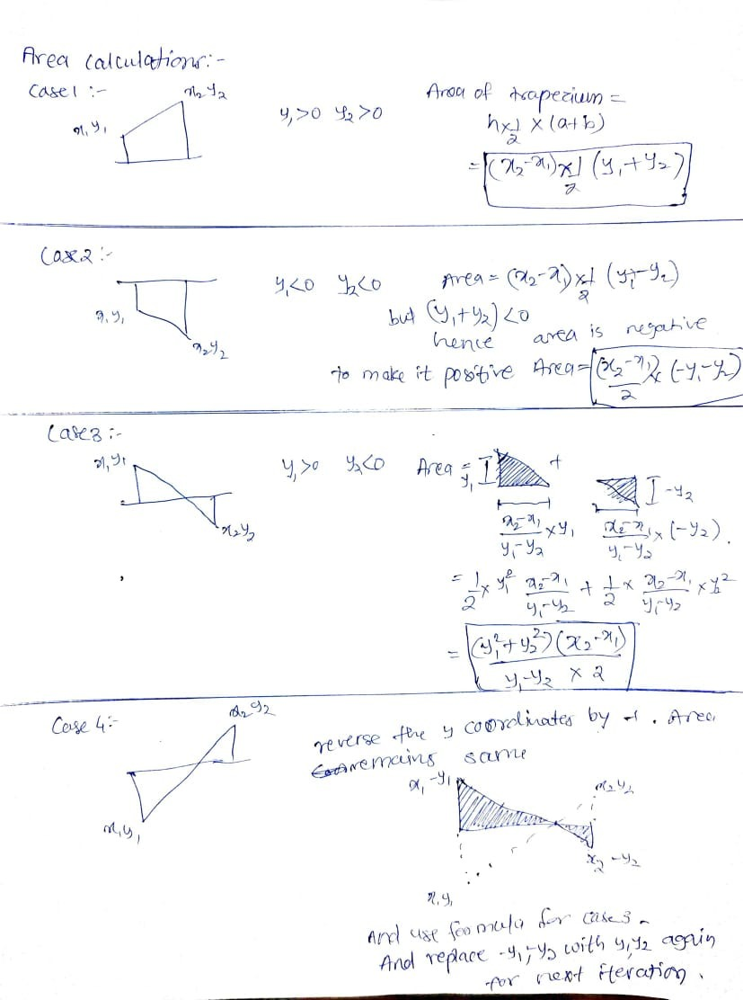

# Assignment - 1

##### Student Information:

- Anirudha Kulkarni
- 2019CS50421

##### Input:

n : number of points

next 2 x n lines for X and Y coordinates of each point

##### Output:

Area under a curve formed by joining successive points by a straight line

---

### Approach:

##### Design:

- User enters number of points and x coordinate and y coordinate for each point
- User is notified each time with:
  1. index of current point
  2. whether he is entering x coordinate or y coordinate
  3. area calculated so far so that user can deduce if something is wrong like negative area due to overflow without needing to enter large number of points. User can observe area growth
- For bad n like negative or 0 program is terminated with custom message
- Program termination message to avoid confusion
- Same registers are rewritten to use less registers as possible to make program efficient
- Intermediate products and area is stored in double so as to give maximum precision possible
- intermediate sum and differences are stored in 32 bit integer as, if products doesnt exceed 64 bit double then it will not exceed 32 bit int so as to further improve space
- As input from memory is taken once, the program is fast. Most of the data is circulated among 7 registers without calling RAM
- Absolute area is calculated by taking absolute values for negative portion
- conditioners are handled by using branches

##### Workflow:

- Take number of points as input and store it in $t0 register and`points` memory location
- if number of points is less than 1 then input is invalid and`badterminate` branch is executed
- if number of points is 1 then area is outputed as 0
- else all n integers are taken input and area calculated till that point is also shown for better experience
- finally`terminate` branch is executed, total area is shown and program is terminated

##### Area Calculation:

- Area of complete polynomial formed using n points can be broken into n-1 trapeziums with 2 sides parallel to y axis and 1 side parallel to x axis.
- Area is calculated in absolute values. Area below x-axis is negated to get positive area
- Any general case can be divided into 4 cases. Each area can be calculated individually and added
- 

##### Registers used:

- t0 = No of points
- t1 = iterator for "for-loop"
- t3 = Xprev
- t4 = Yprev
- t5 = Xcurr
- t6 = Ycurr
- f4 = area so far
- t7, t8 = temporary addition, substractions
- f6, f8 = temporary products which are large

---

### Testing:

Testing is done casewise by taking corner cases of inputs, overflows, bad inputs. Find actual tests and outputs in testing folder.

1. Bad number of inputs: n<1
2. With single point: n = 1
   Area of single point is 0 irrespective of its x and y coordinates
3. With 2 points such that positive area = negative area:
4. With Large X and Y coordinate to check oveflow:
   Works till 10^8 x and y range. When y\*\*2 crosses 64-bit limit overflow occurs
   When y\*\*2 crosses 64-bit limit overflow occurs
5. Points with same X coordinate:
   for same x coordinate width of curve is 0 hence area should be 0 irrespective of height
6. Decimal area:
   To check doubles
7. Random numbers:
   To check 4 cases of area mentioned above
   y1>0, y2>0; y1<0, y2>0; y1<0, y2<0; y1>0, y2<0;
