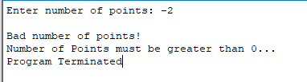
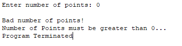
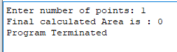
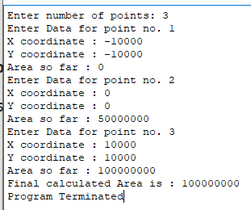
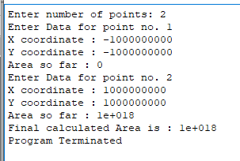
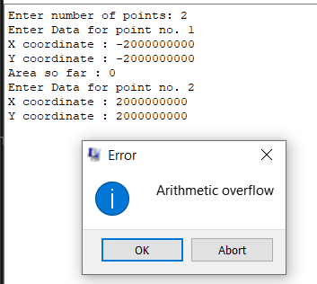
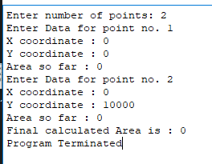
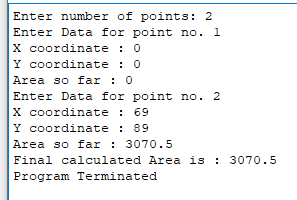
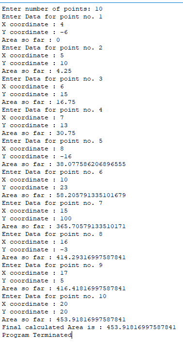

### Testing:

Testing is done casewise by taking corner cases of inputs, overflows, bad inputs

##### 1. Bad number of inputs:

- 
- 

##### 2. With single point:

Area of single point is 0 irrespective of its x and y coordinates

##### 3. With 2 points such that positive area = negative area:

3 points at (-10000,-10000), (0,0), (10000,10000). Area1 = Area2. Hence, Area = Area1+Area2= 1/2*10000 *10000 * 2 = 50000000 *2 = 100000000

##### 4. With Large X and Y coordinate to check oveflow:

Works till 10^8 x and y range. When y\*\*2 crosses 64-bit limit overflow occurs

When y\*\*2 crosses 64-bit limit overflow occurs

##### 5. Points with same X coordinate:

for same x coordinate width of curve is 0 hence area should be 0 irrespective of height

##### 6. Decimal area:

2 points at (0,0), (69,89). Area = (69-0)_(89+0)/2=69 _ 89/2 = 6141/2 = 3070.5

##### 7. Random numbers:

This test case contain all the 4 cases of area mentioned above.

y1>0, y2>0; y1<0, y2>0; y1<0, y2<0; y1>0, y2<0;

which matches with actual calculated area = 453.918
