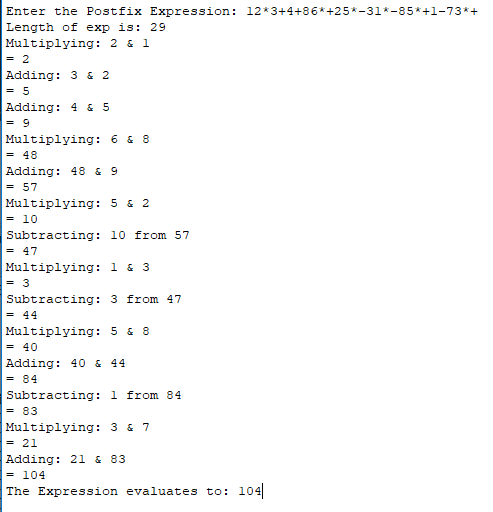
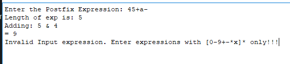
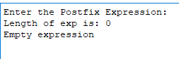
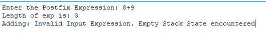
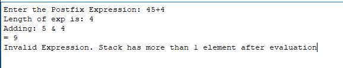

# Testcases:

1. simple string with all 4 operations

1 2 _ 3+4+ 8 6 _ +2 5 _-3 1 _ -8 5 _ +1-7 3 _+ =

1 _ 2 + 3 + 4 + 8 _ 6 - 2 _ 5 - (3 _ 1) + 8 _ 5 - 1 + 7 _ 3 = 104

2. invalid inputs

45+a- = 4+5 - a

3. Empty expression

5. Empty stack at the end:

8+9 = invalid postfix

5. Extra Element in the stack:

45+4 = invalid string

