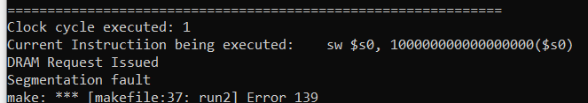

## Testing:

#### Strategy:

1. Drastic reduction in cycles. Contrasting with without optimization (lefyt) (180+10), DRAM reordering (middle) (70), DRAM reordering with Non blocking access (right) (63)

```bash
main:
	addi $s0, $zero, 1000
	addi $s1, $zero, 2500
	addi $t0, $zero, 1
	addi $t1, $zero, 2
	addi $t2, $zero, 3
	addi $t3, $zero, 4
	sw $t0, 0($s0)
	sw $t1, 0($s1)
	sw $t2, 4($s0)
	sw $t4, 4($s1)
	lw $t5, 0($s0)
	lw $t6, 0($s1)
	lw $t7, 4($s0)
	lw $t8, 4($s1)
```


2. Reordering with NBA impact 63+10, 73, 71

```bash
addi $t0, $t0, 5000
addi $t1, $t1, 10000
addi $t2, $t2, 1000
lw $s0, 0 ($t2)
lw $s1, 0 ($t0)
lw $s2, 7500 ($s1)
add $s2, $s2, $s5
```


3. Accessing non existential values from DRAM memory. Returns garbage values vs 0. 181+10, 91, 84 cylces

```bash
main:
	addi $s0, $zero, 1000
	addi $s1, $zero, 2500
	addi $s5, $zero, 4000
	addi $t0, $zero, 1
	addi $t1, $zero, 2
	addi $t2, $zero, 3
	addi $t3, $zero, 4
	sw $t0, 0($s0)
	sw $t1, 0($s1)
	sw $t2, 4($s0)
	sw $t4, 4($s1)
	lw $t5, 0($s0)
	lw $t6, 0($s5)
	lw $t7, 4($s0)
	lw $t8, 4($s1)
exit:
```


4. Intermediate optimizations

```bash
addi $t0, $t0, 1000
addi $t1, $t1, 2500
addi $t2, $t2, 5000
addi $t3, $t3, 7500
addi $t4, $t4, 10000
sw $t4, 0 ($t1)
lw $s0, 0 ($t4)
sw $s0, 0 ($t1)
add $s0, $s1, $t4
```


5. slt instruction optimization

```bash
main:
	addi $s0, $zero, 1000
	addi $s5, $s5, 10000
	addi $s1, $zero, 0
	addi $s2, $zero, 2
	addi $t1, $zero, 0
initloop: 
	addi $t1, $t1, 1
	sw $t1, 0($s0)
	addi $s0, $s0, 4
	addi $s1, $s1, 1
	sw $t7, 0 ($s5)
	slt $s3, $s1, $s2
	bne $s3, $zero, initloop
	addi $s0, $zero, 1000
	addi $s1, $zero, 0
	addi $s3, $zero, 0
	addi $s2, $zero, 2
sumloop:
	lw $t0, 0($s0)
	addi $s0, $s0, 4
	lw $t1, 0($s0)
	add $t2, $t0, $t1
	sw $t2, 0($s0)
	addi $s1, $s1, 1
	slt $s3, $s1, $s2
	bne $s3, $zero, sumloop
```


6. Jump instruction optimization 

```bash
addi $t1, $t1, 5
sw $t1, 2500 ($t0)
main: 
    addi $t1, $t1, -1
    lw $t2, 5000 ($t0)
    beq $t1, $t0, label
    j main
label:
    add $t0, $t2, $t1
```

#### Exceptions:

1. Out of bound access:

```bash
main:
   sw $s0, 100000000000($s0)
```



2. Non existent register:

```bash
main:
   addi $s9, $s12, 12
```


3. Invalid instruction:

```bash
main:
   sw5 $s0, 1024
```


4. Invalid Branch:

```bash
main:
  j abc
```


5. Invalid syntax of instruction:

```bash
main:
   addi $s0, $s1, $s2
```


